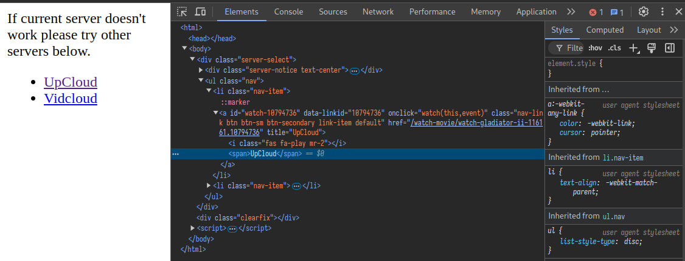
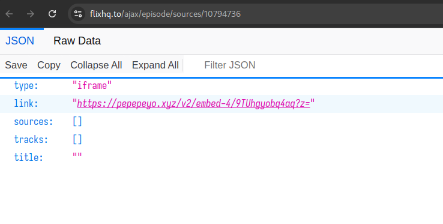
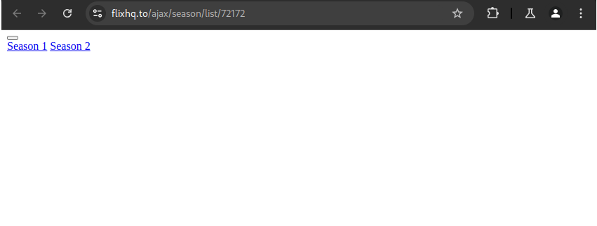
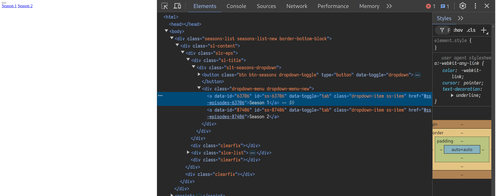
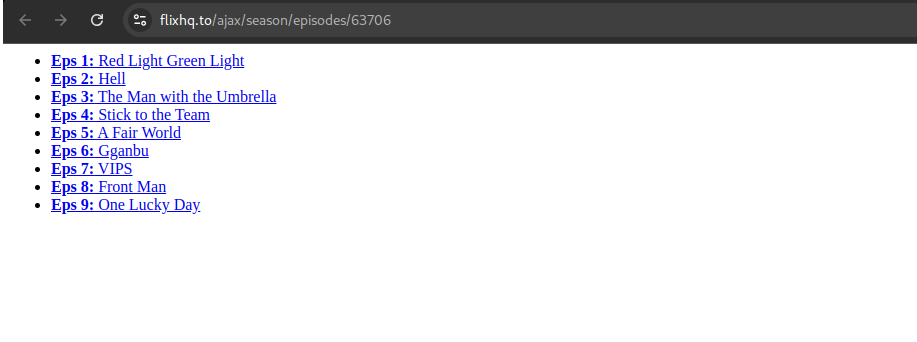
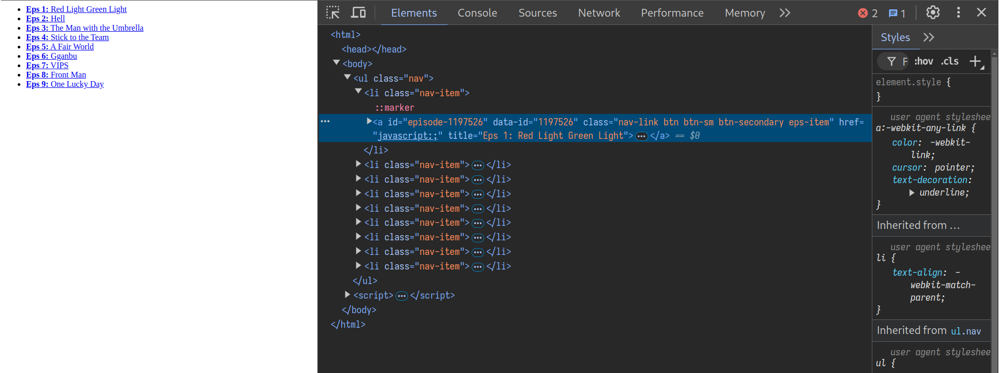
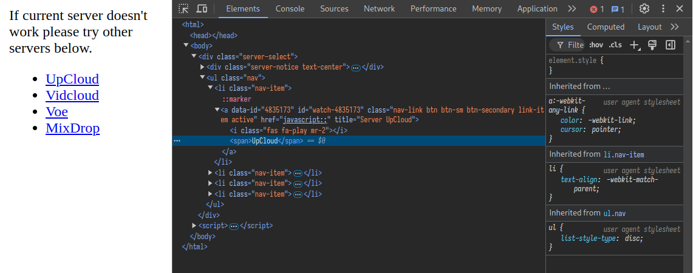
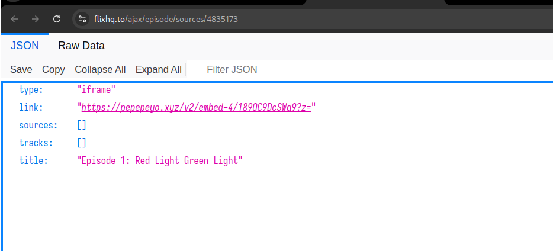

# How to Get Embed URLs from FlixHQ

This guide explains how to obtain embed URLs for movies and TV shows from FlixHQ. The process differs slightly between movies and TV shows.

## Supported Servers
Currently supported servers are:
- VidCloud
- UpCloud
- MegaCloud

## Movies

1. **Get the Movie ID**
   - Example movie ID:  `movie/watch-gladiator-ii-116161`

2. **Get Server List**
   - Make a request to: `https://flixhq.to/ajax/episode/list/{movie_id}`
   - Example: `https://flixhq.to/ajax/episode/list/116161`
   - This will return a list of available servers with their IDs
   
   

3. **Get Embed URL**
   - Make a request to: `https://flixhq.to/ajax/episode/sources/{server_id}`
   - Example: `https://flixhq.to/ajax/episode/sources/4835173`
   - The `link` field in the response contains the embed URL
   
   
   
   - Note: Embed URLs are dynamic and will change over time

## TV Shows

1. **Get the TV Show ID**
   - Example TV show ID `tv/watch-squid-game-72172`

2. **Get Season List**
   - Make a request to: `https://flixhq.to/ajax/season/list/{show_id}`
   - Example: `https://flixhq.to/ajax/season/list/72172`
   
   
   
   - Season IDs can be found in the HTML elements of the response
   
   

3. **Get Episode List**
   - Make a request to: `https://flixhq.to/ajax/season/episodes/{season_id}`
   - Example: `https://flixhq.to/ajax/season/episodes/63706`
   
   
   
   - Episode IDs can be found in the HTML elements of the response
   
   

4. **Get Server List**
   - Make a request to: `https://flixhq.to/ajax/episode/servers/{episode_id}`
   - Example: `https://flixhq.to/ajax/episode/servers/1197526`
   
   

5. **Get Embed URL**
   - Make a request to: `https://flixhq.to/ajax/episode/sources/{server_id}`
   
   - The `link` field in the response contains the embed URL
   - Note: Embed URLs are dynamic and will change over time

